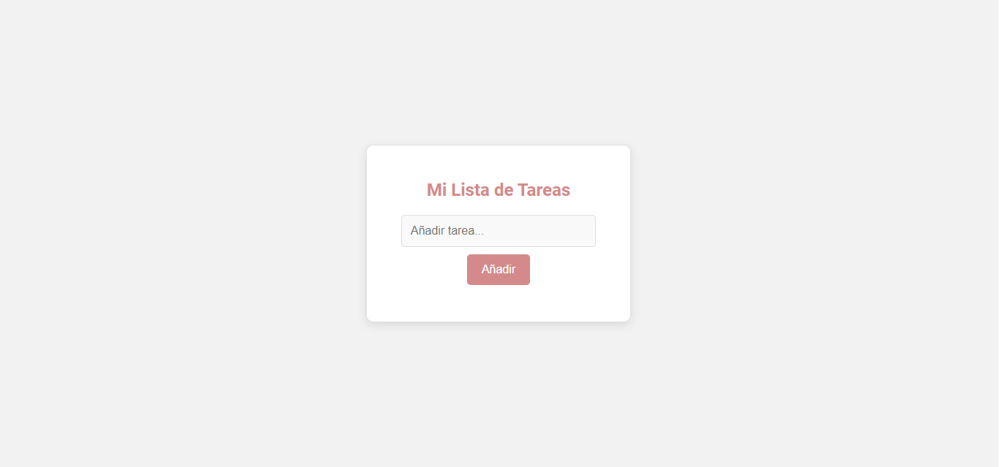
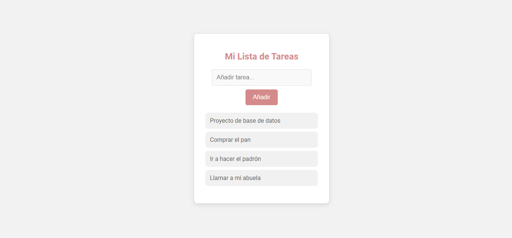
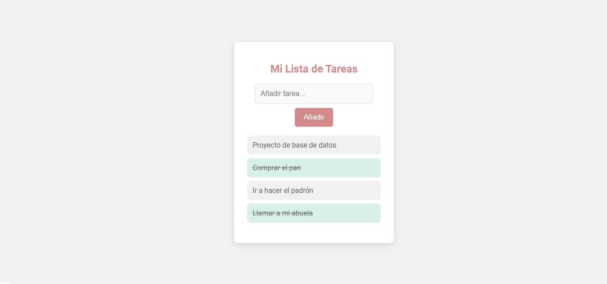

# 📝 Lista de Tareas - Todo List 📋

¡Bienvenido a la aplicación **Lista de Tareas**! Este proyecto te permite gestionar tus tareas de manera sencilla y visual, añadiendo, completando y eliminando tareas de tu lista.

---

## 🌟 Características

- **Añadir tareas**: Puedes agregar tareas rápidamente con un simple campo de texto.
- **Completar tareas**: Haz clic en una tarea para marcarla como completada.
- **Eliminar tareas**: Si ya no necesitas una tarea, puedes eliminarla fácilmente con un solo clic.
- **Diseño atractivo**: Estilo limpio y moderno con interactividad.

---

## 📦 Tecnologías Usadas

- **HTML5**: Estructura de la página web.
- **CSS3**: Estilo y diseño responsivo.
- **JavaScript**: Interactividad de la aplicación.

---

## 🚀 Cómo Usar

1. **Abre el archivo `index.html`**:  
   Una vez clonado el repositorio, abre el archivo `index.html` en tu navegador favorito.

2. **Disfruta de la aplicación**:  
   ¡Empieza a gestionar tus tareas agregando, completando o eliminando tareas de la lista!

---

## 📸 Capturas de Pantalla




---

## ⚙️ Cómo Funciona

- **Añadir tareas**:  
  Haz clic en el botón de **"Añadir"** después de escribir una tarea en el campo de entrada.

- **Completar tareas**:  
  Haz clic en una tarea para marcarla como completada, lo que la cruzará.

- **Eliminar tareas**:  
  Haz clic en el icono de la **papelera** para eliminar la tarea de la lista.

---

## 🛠 Instalación

1. **Clonar el proyecto**:

   Si no tienes Git instalado, puedes descargarlo [aquí](https://git-scm.com/).

   Luego, clona el repositorio en tu máquina:

   ```bash
   git clone https://github.com/tu_usuario/lista-de-tareas.git
2. **Abrir el archivo HTML**:

  Abre el archivo index.html en cualquier navegador web moderno (Chrome, Firefox, etc.).

  ¡Gracias por visitar! 🎉
